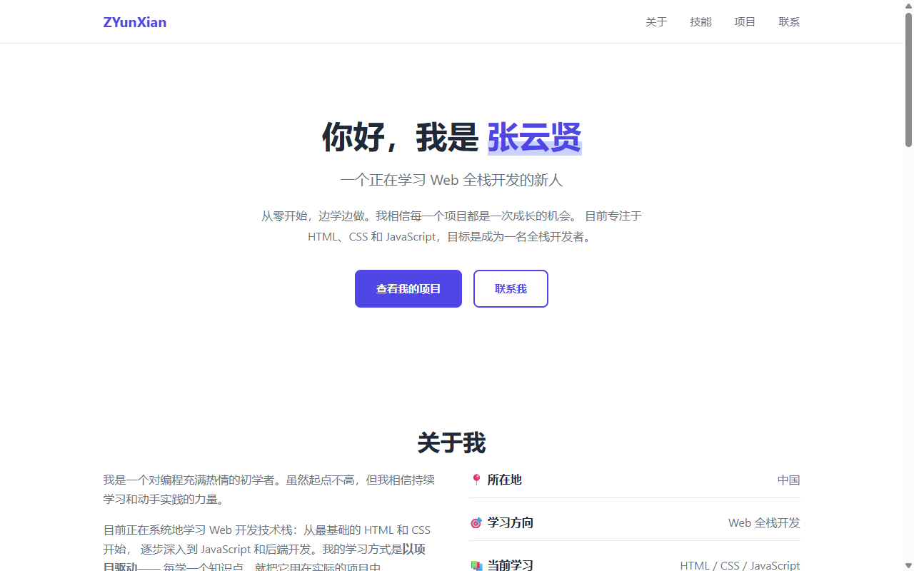

# 🌐 个人主页

> 纯 HTML + CSS 构建的响应式个人主页，我的第一个 Web 项目。

[](https://developer.mozilla.org/zh-CN/docs/Web/HTML)
[](https://developer.mozilla.org/zh-CN/docs/Web/CSS)
[](https://zyx-66.github.io/personal-homepage/)

## 🖥️ 预览



## ✨ 特性

- 📱 **响应式设计** — 适配手机、平板、电脑三种屏幕
- 🎨 **现代简约风格** — 靛蓝配色 + 卡片布局
- 🧭 **吸顶导航** — 固定在顶部，点击平滑滚动
- 🎯 **完整的个人信息展示** — 关于、技能、项目、联系方式
- ⚡ **零依赖** — 纯原生 HTML + CSS，不依赖任何框架
- 🔗 **项目作品集** — 卡片式展示，链接到实际项目

## 🛠️ 技术栈

| 技术 | 说明 |
|------|------|
| HTML5 | 语义化标签，结构化内容 |
| CSS3 | Flexbox + Grid 布局，CSS 变量，过渡动画 |
| GitHub Pages | 免费静态网站托管 |

## 📁 项目结构

```
personal-homepage/
├── index.html      ← 页面结构
├── style.css       ← 样式表
└── screenshots/    ← 截图（自己截了放这里）
```

## 🚀 部署

本项目部署在 GitHub Pages 上。

### 自己部署

1. Fork 本项目
2. Settings → Pages → Source 选 `main` 分支
3. 等 1 分钟，你的页面就在 `https://你的用户名.github.io/personal-homepage/` 上线了

## 📝 学习笔记

这是我的第一个 Web 项目，在构建过程中学到了：

- HTML 语义化结构：`<nav>` `<section>` `<header>` `<footer>`
- CSS Flexbox 和 Grid 布局
- CSS 变量（`--primary`, `--text` 等）统一管理颜色
- 媒体查询（`@media`）实现响应式
- 粘性定位（`position: sticky`）实现吸顶导航
- 平滑滚动（`scroll-behavior: smooth`）

## 🔮 后续计划

- [ ] 添加深色模式
- [ ] 加入更多交互动效
- [ ] 接入博客系统

---

📧 17837521829@163.com | 🐙 [zyx-66](https://github.com/zyx-66)
